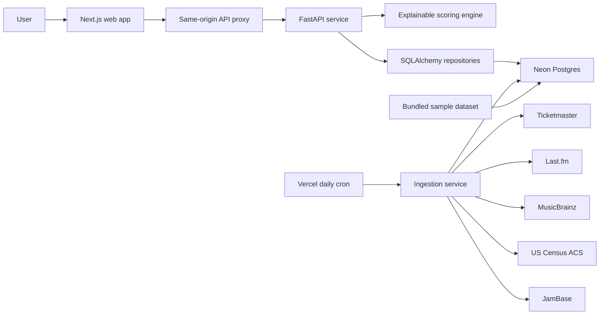

# VenueMatch

## Portfolio Card Copy

**VenueMatch is an explainable booking-intelligence platform for independent music.** It combines public concert, artist, venue, and demographic data to rank the best venues for an artist or the best artists for a venue. I built the product end to end with a Python recommendation engine, automated data ingestion, a FastAPI service, a Next.js interface, Neon Postgres, and Vercel deployment.

**Tags:** Python, FastAPI, Next.js, TypeScript, PostgreSQL, SQLAlchemy, data pipelines, recommendation systems, explainable recommendations, Vercel

**Live product:** [venue-match-web.vercel.app](https://venue-match-web.vercel.app)  
**Source code:** [github.com/Amoux98021/Venue_Match](https://github.com/Amoux98021/Venue_Match)

---

## Executive Summary

Booking a concert is a matching problem with incomplete information. Artists need rooms that fit their audience, sound, and market demand. Venues need performers who make sense for their capacity, city, and booking identity. Smaller teams often make these decisions using fragmented spreadsheets, intuition, and several disconnected platforms.

I built VenueMatch to turn those signals into a transparent recommendation. A user can start with an artist and target city to receive ranked venues, or start with a venue or city to receive ranked artists. Every result exposes the score components and a plain-language explanation rather than hiding the decision behind an opaque model.

The first version was a Python and Streamlit MVP backed by SQLite and sample data. I then evolved it into a production web application with a Next.js frontend, FastAPI backend, Neon Postgres database, scheduled ingestion, modular provider clients, resilient fallback behavior, and application-level API cost controls.

## At a Glance

| Category | Production result |
| --- | --- |
| Product | Bidirectional artist-to-venue recommendation platform |
| Live catalog | 2,598 artists and 127 venues |
| Booking data | 4,947 event-performer records |
| Genre data | 4,480 artist-genre links and 818 venue-genre signals |
| Market data | 217 city-genre signals across ten target cities |
| Capacity provenance | 70 stored venue-capacity source records |
| Automation | 29 completed ingestion runs as of August 4, 2026 |
| Storage | Approximately 13.5 MB in Neon Postgres |
| Quality | 15 backend tests, clean ESLint, zero npm audit findings, successful production Next.js build |
| Deployment | Separate frontend and API projects on Vercel |

The database metrics above are a production snapshot from August 4, 2026. The `events` table stores one row per artist-event-venue relationship, so multi-artist concerts produce multiple event-performer records.

## The Problem

The central product question was:

> How can an artist, manager, promoter, or venue operator quickly identify promising booking matches without access to private ticket-sales data?

This created four constraints:

1. The recommendation needed to work with official APIs and public datasets only.
2. The result needed to remain understandable while real outcome labels were unavailable.
3. Missing values, especially venue capacity and artist popularity, could not crash or invalidate the ranking.
4. The MVP had to run affordably on free or low-cost infrastructure.

## Product Goals

- Rank venues for a selected artist and city.
- Rank artists for a selected venue or city.
- Make every score inspectable and explainable.
- Show city demographics and local genre signals.
- Provide a raw-data view for debugging and trust.
- Continue working in sample mode when API credentials are absent.
- Use a schema and feature pipeline that can support supervised ML later.

## Core User Experience

### Artist to venue

A user selects an artist and target city. VenueMatch evaluates the available rooms and returns:

- venue name and location
- capacity and capacity provenance when available
- genre fit
- historical venue match
- local demand
- capacity fit
- artist popularity
- final recommendation score
- a short explanation of the ranking

### Venue to artist

A user enters a venue name or city. VenueMatch evaluates the artist catalog, finds the best venue fit for each artist, and returns the strongest candidates.

### City pulse

The city dashboard combines Census demographics, venue inventory, and normalized genre activity so users can understand the market behind a recommendation.

### Raw data

A whitelisted raw-data preview exposes the normalized tables without exposing secrets or arbitrary database queries. This made the MVP easier to audit, demo, and debug.

## System Architecture



### Technology choices

| Layer | Choice | Why |
| --- | --- | --- |
| Frontend | Next.js, React, TypeScript | More control and a stronger production UX than Streamlit |
| API | FastAPI | Python-first, typed request validation, automatic API documentation |
| Data access | SQLAlchemy | One persistence layer for local SQLite and production Postgres |
| Production database | Neon Postgres | Persistent serverless-compatible storage with a generous MVP allowance |
| Local database | SQLite | Zero-setup development and repeatable tests |
| Hosting | Vercel | Separate deployable frontend and Python API with scheduled cron support |
| Scoring | Transparent rules | Useful before trustworthy outcome labels exist |
| ML placeholder | Logistic regression and random forest | A defined upgrade path once labels are sufficient |

## Data Pipeline

VenueMatch uses modular clients so provider-specific authentication, URLs, and response handling stay outside the recommendation logic.

| Source | Product signal |
| --- | --- |
| Ticketmaster Discovery API | Upcoming music events, artists, venues, dates, locations, genre classifications |
| Last.fm API | Artist listeners, popularity proxy, and top tags |
| MusicBrainz API | Artist identity enrichment and cross-platform IDs |
| US Census ACS | Population, median age, and median household income |
| JamBase API | Venue identity, capacity provenance, and event catalog enrichment |
| Spotify client | Optional enrichment path, not required for production operation |

The daily ingestion job queries ten target cities: Washington, Baltimore, Philadelphia, New York, College Park, Richmond, Pittsburgh, Newark, Buffalo, and Boston. It performs idempotent upserts, enriches a bounded number of artists and venues, rebuilds aggregate demand features, records run metadata, and preserves existing live data if a provider returns no usable events.

Important pipeline safeguards include:

- deterministic IDs for repeatable upserts
- additive database migrations for existing deployments
- one-year retention for Ticketmaster event rows
- bounded per-run provider work to fit serverless time limits
- provider-specific error isolation
- MusicBrainz request pacing
- resumable JamBase event backfills
- per-venue progress markers to avoid duplicate API spending
- graceful sample mode when credentials are missing

## Data Model

The normalized schema separates source entities from derived recommendation features:

- `artists`
- `venues`
- `events`
- `artist_genres`
- `city_demographics`
- `city_genre_signals`
- `venue_genre_history`
- `venue_capacity_sources`
- `recommendations`
- `ingestion_runs`
- `provider_api_usage`

This design avoids storing large raw provider responses in production. It also preserves provenance for sensitive fields such as venue capacity, including source, source record, URL, and retrieval time.

## Recommendation Design

I intentionally shipped a transparent rules engine before training an ML model. The available event history showed that an artist appeared at a venue, but it did not reliably indicate whether the booking succeeded. Training on attendance or sales proxies without trustworthy labels would have created false confidence.

The final score is:

```text
final_score =
  0.35 * genre_fit_score +
  0.25 * venue_history_score +
  0.20 * city_demand_score +
  0.10 * capacity_fit_score +
  0.10 * artist_popularity_score
```

### Genre fit

Artist tags are compared with venue booking genres using normalized Jaccard overlap. The score also incorporates city demand so a venue is not evaluated in isolation from its local market.

```text
jaccard(A, B) = |A intersection B| / |A union B|
```

### Venue history

Historical genre counts are normalized within each venue. Genres that repeatedly appear at a venue contribute more than one-off bookings.

### City demand

Event frequency is aggregated by city, state, and genre, then normalized against the strongest genre in that market. This creates a simple and explainable demand proxy without claiming access to private sales data.

### Capacity fit

Artist popularity estimates an appropriate room size:

```text
target_capacity = 200 + popularity_score * 5,800
```

The score decreases as actual capacity moves away from the estimated draw. If capacity is missing, VenueMatch assigns a neutral-low score of `0.45` and explicitly lowers confidence rather than discarding the venue.

### Artist popularity

Last.fm listener counts are log-scaled so global acts do not completely overwhelm emerging artists. When popularity data is unavailable, the engine uses a neutral `0.50` value.

### Explanation layer

Every recommendation includes matched genres, local demand, capacity context, and the five component scores. The UI displays both bars and numeric values so users can understand why one match outranked another.

## From MVP To Production

### Phase 1: Python-first proof of concept

The first release established the schema, sample dataset, modular clients, ingestion scripts, scoring engine, baseline model placeholder, and Streamlit demo. Sample mode covered the five target markets so development was never blocked by API access.

### Phase 2: Production web experience

Streamlit was replaced with a custom Next.js interface and FastAPI service. The frontend uses a same-origin server proxy, keeping the backend URL and provider credentials out of browser code. The interface includes four focused workspaces: artist to venue, venue to artist, city pulse, and raw data.

### Phase 3: Live data and automation

SQLite remained available locally, while Neon Postgres became the production database. A protected Vercel cron endpoint began refreshing Ticketmaster, Last.fm, MusicBrainz, Census, and JamBase data daily.

### Phase 4: Capacity and catalog expansion

JamBase venue matching added capacity provenance. A manual override path handled verified exceptions such as Nikki Lopez Philly. A one-time event backfill expanded the catalog from 625 to 2,254 artists and from 882 to 4,019 event-performer rows. Expanding the live corridor to ten cities and enriching newly matched venues brought the catalog to its current 2,598 artists, 127 venues, and 4,947 event-performer rows.

## Key Engineering Challenges

### 1. Moving beyond Streamlit without losing Python

**Challenge:** Streamlit made the first demo fast, but limited interface control and production architecture.

**Decision:** Keep Python for data and scoring, expose it through FastAPI, and build the product experience in Next.js.

**Result:** The project retained a Python-first core while gaining a responsive, brandable interface and independent frontend/backend deployment.

### 2. Operating without Spotify as a hard dependency

**Challenge:** Spotify access was not reliably available during development.

**Decision:** Treat Spotify as optional and use Last.fm listeners, public tags, and event frequency as the primary popularity and demand signals.

**Result:** The live product could launch and remain useful without a single provider becoming a blocker.

### 3. Persisting data on serverless infrastructure

**Challenge:** Local SQLite cannot provide durable shared storage across Vercel functions.

**Decision:** Keep SQLite for local development and add Neon Postgres behind the same SQLAlchemy layer.

**Result:** Local setup stayed simple while production gained persistent, concurrent storage without maintaining a server.

### 4. Handling missing and uncertain venue capacity

**Challenge:** Capacity is important for fit, but is not consistently available.

**Decision:** Store source provenance, verification timestamps, and manual overrides. Missing capacity receives a reduced-confidence score rather than being silently imputed as fact.

**Result:** Capacity became useful without pretending the data was complete or equally reliable.

### 5. Preventing third-party API overages

**Challenge:** JamBase's Developer allowance is limited and paid overages can continue after the included quota. The [official rate-limit documentation](https://data.jambase.com/api/docs/rate-limits) lists 1,000 monthly calls and a $0.05 per-call overage for this tier.

**Decision:** Add a Postgres-backed monthly usage ledger. Every JamBase client request atomically reserves a call before contacting the provider. VenueMatch hard-caps itself at 950 calls, preserving a 50-call buffer below the 1,000-call plan allowance.

**Result:** Concurrent functions cannot race past the application budget, and usage is visible through the ingestion status endpoint. The ledger recorded 71 calls in July and 18 calls through the August 4 expansion, leaving 932 application-budget calls for the month.

### 6. Recovering from provider and entity failures

**Challenge:** Historical JamBase access ended with the trial, and one stored venue identifier returned an isolated client error. JamBase's [historical-data documentation](https://data.jambase.com/api/docs/historical-data) limits the Developer plan to future events.

**Decision:** Add a Developer-compatible future-event mode, separate progress markers, and logic that skips invalid individual venues while stopping on authentication, quota, or rate-limit failures.

**Result:** The catalog expansion completed without repeatedly spending calls on a bad record or losing successfully ingested batches.

## Product And Visual Design

The interface uses an editorial operations-desk direction rather than a generic dashboard. Newsreader provides expressive display typography, Manrope handles dense UI text, and an acid-green and signal-orange palette makes scores and system states easy to scan.

The design emphasizes:

- a large value proposition before the tool
- the scoring formula as a visible product feature
- ranking cards with clear hierarchy
- five-part score breakdowns
- source-aware capacity labels
- concise explanation panels
- responsive layouts for desktop and mobile
- keyboard-visible focus states
- a raw-data table for technical users

## Reliability, Security, And Legal Boundaries

- Provider credentials are environment variables and are never committed.
- Scheduled ingestion endpoints require a constant-time checked bearer secret.
- Browser traffic uses a same-origin Next.js proxy.
- CORS origins are explicitly configured.
- Raw-data access is limited to named datasets.
- Provider errors are recorded without exposing secrets.
- Sample mode prevents empty or broken demos.
- The project uses official APIs and public datasets only.
- VenueMatch does not scrape private ticket inventory or sales systems.
- JamBase source URLs and capacity provenance are stored for attribution.
- The current JamBase Developer tier is intended for non-commercial use, so a commercial launch would require a plan and licensing review.

## Validation

The current repository passes:

- 15 backend tests covering scoring weights, city filtering, API behavior, seed mode, idempotent ingestion, data preservation, capacity overrides, identity enrichment, resumable backfills, invalid venue handling, and quota enforcement
- ESLint across the Next.js application
- TypeScript validation during the production build
- a successful Next.js 16 production build
- production API health and recommendation smoke tests

## Results

VenueMatch demonstrates more than a recommendation formula. It shows a complete path from product hypothesis to a deployed data product:

- converted a local demo into a production frontend/API architecture
- integrated five official or public data sources while keeping Spotify optional
- grew the live catalog by more than 3.6x during the JamBase expansion
- persisted more than 4,000 event-performer relationships in a normalized database
- automated daily refreshes without sacrificing local reproducibility
- preserved explainability at every ranking step
- added quota controls before overages became a production problem
- kept the production database near 13 MB through normalized, bounded storage

These are system and data outcomes. VenueMatch has not yet been validated against booking revenue, ticket sales, or attendance outcomes.

## Limitations

- Local demand currently measures event frequency, not ticket conversion or streaming demand by city.
- Artist popularity is a proxy derived primarily from Last.fm, not a complete cross-platform audience model.
- Capacity coverage and source quality vary by venue.
- Stable artist IDs begin with normalized names, so stronger entity-resolution rules will be useful as the catalog grows.
- The scoring weights are product assumptions that still need user research and outcome calibration.
- The supervised model remains intentionally gated because there are not enough reliable positive and negative booking labels.

## Next Steps

1. Collect explicit booking outcomes such as sell-through bands, attendance, promoter acceptance, or repeat bookings.
2. Evaluate the rule-based baseline with precision at K, recall at K, and ranking agreement from booking professionals.
3. Train logistic regression first for interpretability, then compare it with random forest performance.
4. Add stronger artist and venue entity resolution across Ticketmaster, MusicBrainz, JamBase, and Spotify identifiers.
5. Replace event-frequency demand with richer market signals where licensing allows.
6. Add user accounts, saved shortlists, notes, and collaboration workflows.
7. Add provider-health alerts and a dashboard warning when credentials expire.
8. Expand from the East Coast test corridor into Midwest, South, and West Coast markets.

## What I Learned

The most important product decision was not using ML too early. A transparent scoring model built on honest proxies was more useful than a sophisticated classifier trained on weak labels. The project also reinforced that data-product quality depends as much on provenance, missing-value behavior, quotas, retries, and deployment constraints as it does on the recommendation formula.

VenueMatch became a stronger portfolio project when the question changed from "Can I calculate a score?" to "Can I operate a trustworthy recommendation product with imperfect public data?"

---

## Resume-Ready Bullets

- Built and deployed an explainable music-booking recommendation platform using Python, FastAPI, Next.js, TypeScript, SQLAlchemy, Neon Postgres, and Vercel.
- Designed a weighted ranking engine combining genre overlap, venue history, local demand, room capacity, and artist popularity across a live catalog of 2,598 artists and 127 venues.
- Developed idempotent ingestion pipelines for Ticketmaster, Last.fm, MusicBrainz, US Census, and JamBase data, producing more than 4,900 normalized artist-event-venue records.
- Implemented provenance-aware capacity enrichment, resilient provider fallbacks, protected cron ingestion, and an atomic monthly API quota circuit breaker.

## Suggested Portfolio Screenshots

1. **Hero and scoring formula:** Show the value proposition and visible model weights.
2. **Artist-to-venue results:** Capture ranked venue cards, capacity provenance, score bars, and explanation text.
3. **Venue-to-artist results:** Demonstrate the bidirectional recommendation workflow.
4. **City pulse dashboard:** Show demographics and normalized genre-demand bars.
5. **Raw data view:** Demonstrate transparency and the normalized data foundation.

Suggested hero caption:

> VenueMatch turns fragmented public music data into transparent booking recommendations, helping artists and venues understand not only which match ranks highest, but why.
